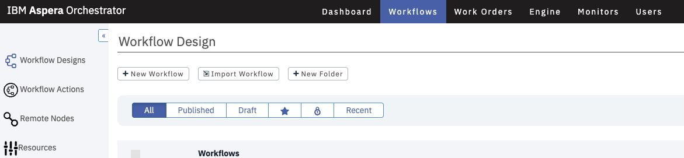
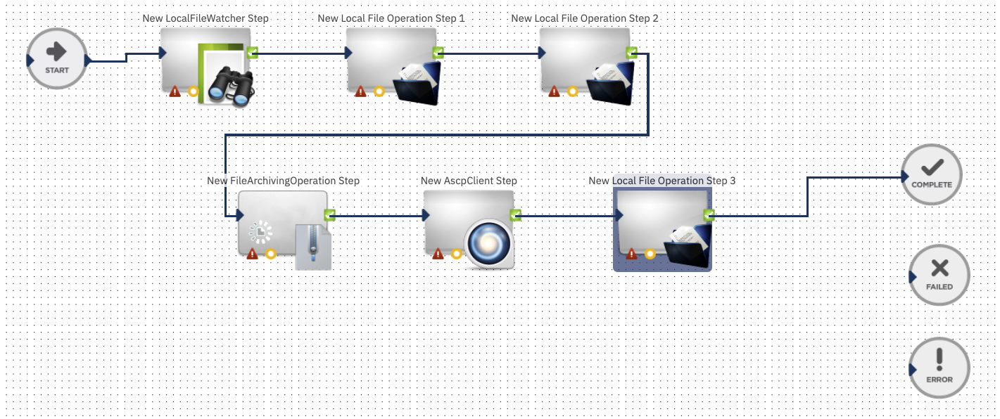
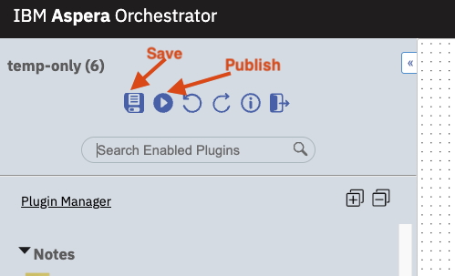

# explore-workflow-automation
Explore Orchestrator - IBM Aspera WorkFlow Automation Engine   
Reference Documents: [https://www.ibm.com/docs/en/aspera-orchestrator/4.0.0](https://www.ibm.com/docs/en/aspera-orchestrator/4.0.0)

The objective of this lab is to give an introduction of Orchestrator. As part of the lab you will learn how to how to import and enable plugins. You will also create 1 sample workflow.   
This is a shared environment. So, when creating workflow, make sure to name your workflow with a prefix (e.g. your first name) to avoid confusion.   

## Pre-Requsites

1. The Orchestrator platform should have already been installed and accessible.  

## Enable Plugin

1. Login to the Orchestrator. Go to Engine -> Plugins.    
Look for the following plugins and enable them if they are not enabled. Refer to screenshot below screenshot on how to identify an enabled plugin.   

List Of Plugins.   
-  LocalFileWatcher   
- LocalFileOperation
- FileArchivingOperation
- AscpClient

## Create WorkFlow
We are going to create a Workflow that will:
- Monitor a local folder for files
- Create a folder with your prefix as a working directory
- Copy the detected file to the sub folder created.
- compress the file
- transfer the file using ascp to a HSTS server & delete the source compressed file (as part of ascp)
- delete the copied file in the /data/prefix folder.

1. Click on the Workflow tab. You may see some workflows being used by others. DO NOT EDIT or OPEN THESE. Only work on your own workflow.   
2. Click on 'New WorkFlow'.   
    

3. Give a name for the workflow. Make sure to put a prefix for the name. Leave the rest of the fields to default. Click Save. That will take you to the blank workflow creation canvas.   

4. Refer to workflow diagram below. Create the skeleton workflow as in the image below. If you click on Save (Disk Icon) the flow will be saved - but red boxes will appear around the plugin. This is expected because we have not configured the plugins yet. I have numbered the steps for easy recognition.   
  

5. Configure "New Local File Watcher Step"    
This is the step to look for new files (*.dat) in the /data folder.
Double Click on the icon and click 'New Configuration'. Update the 2 fields as highlighted in the image below.   
  

6. Configure "New Local File Operation Step 1"   
In this step, we will will crete a sub folder to be used as your working folder.   
Double Click on the icon and click 'New Configuration'. Update the fields as highlighted in the image below.   

7. Configure "New Local File Operation Step 2"      
Copy the file detected to this new sub folder for processing. 
Double Click on the icon and click 'New Configuration'. Update the fields as highlighted in the image below.   

8. Configure "New File Archiving Operation Step"   
In this step we are going to compress the file copied into the sub folder.      
Double Click on the icon and click 'New Configuration'. Update the fields as highlighted in the image below.      

9. Configure "New ASCP Client Step"   
In this step, we will transfer the compressed file to a HSTS server.   
Double Click on the icon and click 'New Configuration'. Update the fields as highlighted in the image below.     
   

10. Configure "New Local File Operation Step 3"      
Delete the original file copied. 
Double Click on the icon and click 'New Configuration'. Update the fields as highlighted in the image below.   

11. Save and Publish the Workflow.    

12. Execute and Test.      
Go to the Workflows Main page and Start the Workflow.   

13. Click on Work Orders and Select your Workflow to monitor the progress.    

